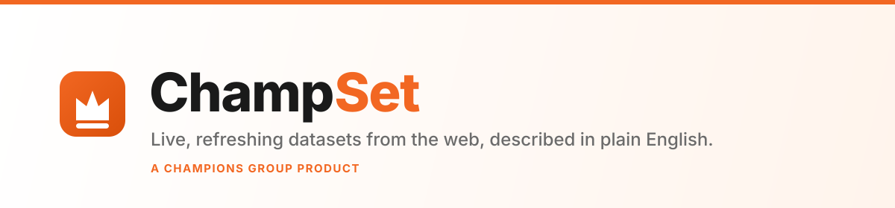

<p align="center">
  
</p>

<p align="center">
  <strong>Build and maintain any dataset from the live web, that refreshes regularly.</strong>
</p>

<p align="center">
  <strong>A Champions Group product.</strong> &nbsp;·&nbsp; <em>Empowering Innovation. Building Resilience.</em>
</p>

<p align="center">
  <a href="LICENSE"></a>
</p>

---

## What is ChampSet?

You type a sentence:

> *"US digital marketing agencies with clients interested in World Cup marketing."*

ChampSet infers the schema automatically, sends autonomous agents to research it on the live web, verifies what they find against real sources, deduplicates, and hands you a structured dataset. Download as CSV or XLSX. Set a refresh cadence (30 min, 6 hours, 12 hours, daily, weekly) and the agents re-run on schedule so the dataset never goes stale.

**Any topic.** GPU prices. Competitor features. Research papers. Prospect lists. Whatever you describe, it builds, and keeps current.

You don't pick a scraper, write selectors, or point it at a URL. You describe the data you care about and ChampSet handles the rest.

### How it works

1. **You describe the dataset** in plain English.
2. **AI infers the schema**: column names, types, primary keys, where to look on the web.
3. **An orchestrator agent** discovers entities via web search.
4. **Sub-agents fan out in parallel**: each investigates one entity, fetches real data, and inserts a verified row with its sources.
5. **You get a structured table**: browse it in the UI, export CSV or XLSX.
6. **Set a refresh cadence** and the agents re-run on schedule.

### Blog data sources (optional)

Besides agent research, you can attach **blog sources** to a dataset. Each source is a blog/domain URL; ChampSet asks a self-hosted [LakeStream](https://github.com/Champ-Deep/LakeStream) service to discover that site's articles and extract each one, then maps the articles onto your dataset's columns as rows.

LakeStream runs outside this stack (its own Docker Compose). Point ChampSet at it with `LAKESTREAM_URL` and generate an API key for `LAKESTREAM_API_KEY`. Without the key, scrape runs start but their articles cannot be imported. LakeStream is open source and self-hosted, so it adds no paid dependency.

### Accuracy score

Every generated row carries an **Accuracy Score** (0-100). A second model grades the row, and the score is the expected value over the digit-token log-probabilities of that grade, scaled to 0-100. A confident high grade scores high; a model torn between a high and a low grade scores in the middle. The score shows as a fixed **Accuracy Score** column in every dataset, and in CSV/XLSX exports.

Scoring uses `ACCURACY_SCORING_MODEL` (default `openai/gpt-4o-mini`) and must be a model that returns logprobs via OpenRouter. If scoring is unavailable, the row is still inserted, just without a score.

### Web access is fully self-hosted

ChampSet does its web search and page reading with open-source software that runs inside your own stack. There is no third-party data API and no per-call data vendor:

- **Search** uses a self-hosted [SearXNG](https://docs.searxng.org/) metasearch instance (aggregates Google, Bing, DuckDuckGo, Brave). No API key.
- **Fetch** reads pages with [Mozilla Readability](https://github.com/mozilla/readability) and converts them to clean markdown. No API key.

The only paid dependency in the whole product is the LLM provider (OpenRouter). Blog data sources use a separate self-hosted service and add no paid dependency.

---

## Quick start

**Prerequisites:** [Docker](https://docs.docker.com/get-docker/) and [Make](https://www.gnu.org/software/make/).

You need two things, and you can pick the models you want for each:

| Service | What it's for | Get it |
|---------|--------------|--------|
| **OpenRouter** | LLM calls (schema inference + agents) | [openrouter.ai/settings/keys](https://openrouter.ai/settings/keys) |
| **Clerk** | User authentication | [dashboard.clerk.com](https://dashboard.clerk.com) |

### 1. Clone and configure

```bash
git clone git@github.com:Champ-Deep/ChampSet.git champset
cd champset
cp .env.example .env
# Fill in OPENROUTER_API_KEY and your Clerk keys.
```

### 2. Start everything

```bash
make dev
```

This installs dependencies, builds and starts all Docker services (Postgres, Convex, SearXNG, frontend, backend), and deploys the Convex schema. On first run it auto-generates the Convex admin key.

| Service | URL |
|---------|-----|
| **ChampSet app** | [localhost:3500](http://localhost:3500) |
| Convex dashboard | [localhost:6791](http://localhost:6791) |
| Mastra Studio (workflow inspector, dev only) | [localhost:4111](http://localhost:4111) |

Open [localhost:3500](http://localhost:3500) and sign in.

### 3. (optional) Load curated datasets

```bash
make seed-public-datasets
```

---

## Models

Four roles, all routed through OpenRouter, all changeable in the app at **Settings → Models** (per user, no restart) or as defaults in `.env`:

| Role | Default | Notes |
|------|---------|-------|
| Schema inference | `anthropic/claude-sonnet-4.6` | One call per dataset; quality matters most. |
| Populate orchestrator | `qwen/qwen3.7-max` | Plans the run, fans out workers. |
| Investigate sub-agent | `qwen/qwen3.7-max` | One per row; cost-sensitive, high volume. |
| Row accuracy scoring | `openai/gpt-4o-mini` | Grades each generated row; must return logprobs. `.env` only. |

## Your `.env` at a glance

| Variable | Required | Notes |
|----------|----------|-------|
| `OPENROUTER_API_KEY` | Yes | The only paid dependency. |
| `NEXT_PUBLIC_CLERK_PUBLISHABLE_KEY` | Yes | Clerk auth. |
| `CLERK_SECRET_KEY` | Yes | Clerk auth. |
| `CLERK_JWT_ISSUER_DOMAIN` | Yes | Clerk issuer URL. |
| `SEARXNG_URL` | Auto | Defaults to the bundled SearXNG service. |
| `CONVEX_SELF_HOSTED_ADMIN_KEY` | Auto | Generated by `make dev` on first run. |
| `RESEND_API_KEY` | Optional | "Dataset ready" emails. Leave blank to skip. |
| `ACCURACY_SCORING_MODEL` | Optional | Grades each row from logprobs. Defaults to `openai/gpt-4o-mini`. |
| `LAKESTREAM_URL` | Optional | Blog data sources. Points at a self-hosted LakeStream service. |
| `LAKESTREAM_API_KEY` | Optional | Blog data sources. Required to import extracted articles. |

---

## Tech stack

| Layer | Tech |
|-------|------|
| Frontend | Next.js 16, React 19, Tailwind 4 |
| Backend | Fastify + Mastra (TypeScript agent runner) |
| Auth | Clerk |
| Database | Convex (self-hosted) |
| Web search | Self-hosted SearXNG metasearch |
| Page fetch | Mozilla Readability + Turndown |
| AI | Mastra workflows + Vercel AI SDK + OpenRouter |
| Exports | CSV (built-in) + XLSX (SheetJS) |
| Blog scraping | LakeStream (optional, self-hosted) |

## Project structure

```text
champset/
├── frontend/            Next.js 16 app + Convex schema & functions
├── backend/             Fastify + Mastra: schema inference + populate/enrich agents + web tools
├── searxng/             Self-hosted search config
├── docker-compose.dev.yml
├── docker-compose.prod.yml
├── DEPLOY.md            VPS deployment runbook
└── Makefile
```

---

## Deployment

ChampSet runs as a Docker Compose stack with persistent storage. See [DEPLOY.md](DEPLOY.md) for the full VPS runbook (provision, DNS, Convex bootstrap, TLS, backups). The only stateful services are Postgres and Convex.

---

## License & attribution

ChampSet is licensed under [AGPL-3.0](LICENSE).

ChampSet is a Champions Group distribution of the open-source **bigset** project ([github.com/tinyfish-io/bigset](https://github.com/tinyfish-io/bigset)), used under AGPL-3.0. The upstream license and copyright notices are preserved in [`LICENSE`](LICENSE). Champions Group's contribution includes the branding, the self-hosted open-source web backend, and ongoing product work.

> **AGPL note:** if you deploy ChampSet as a network service, you must make the complete corresponding source available to its users.
